- [Evidences](#evidences)
  * [Execution](#execution)
  * [IRSA using Terraform](#irsa-using-terraform)
  * [IRSA using eksctl](#irsa-using-eksctl)
  * [Github Action for deployment](#github-action-for-deployment)
  * [Metric Server](#metric-server)
- [Others](#others)

## Evidences

### Execution
- Start up
- 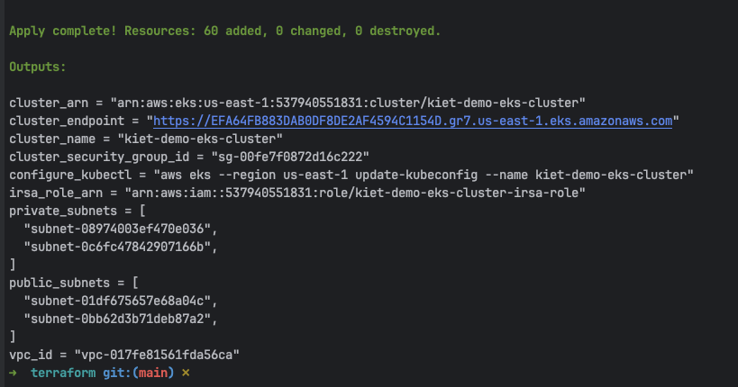

- Tear Down
- 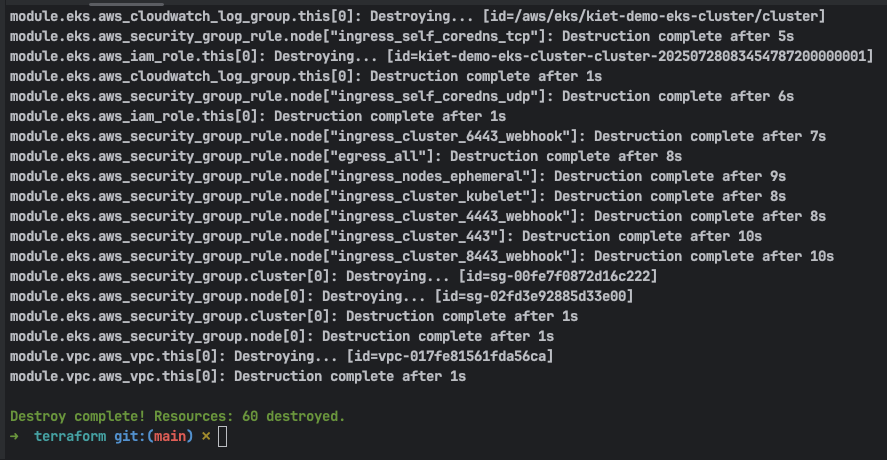

### IRSA using Terraform
- Application is working, and can write to S3 bucket
- 
- 
- 

### IRSA using eksctl
- Remove write permission from irsa role

- 

- Application now cannot access to our services anymore

- 

- Create IAM policy, Service Account and Update deployment to use it

- 
- 
- 
- 

- Application can now write to S3 again

- 
- 

### Github Action for deployment
- Role Permission

- 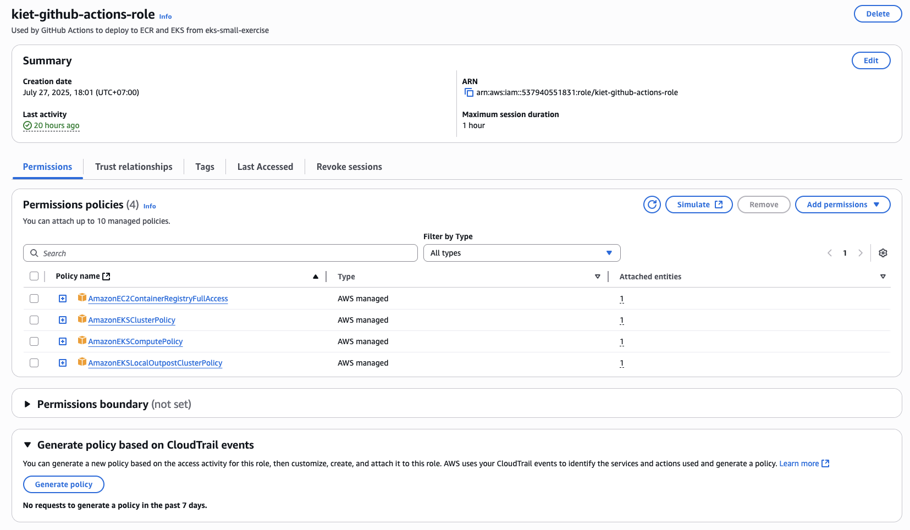
- Role Trust Policy

- 
- Before deployment

- 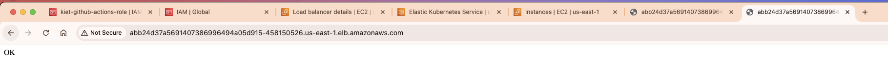
- After deployment

- 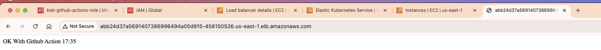
- Others - ECR

- 
- Others - Github Log

- 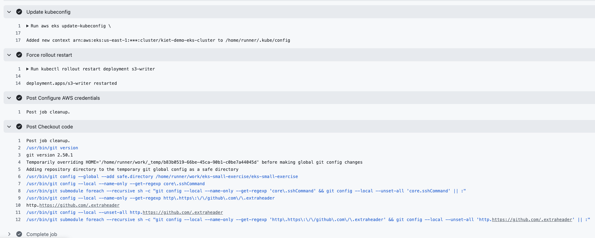
- Config Map

- 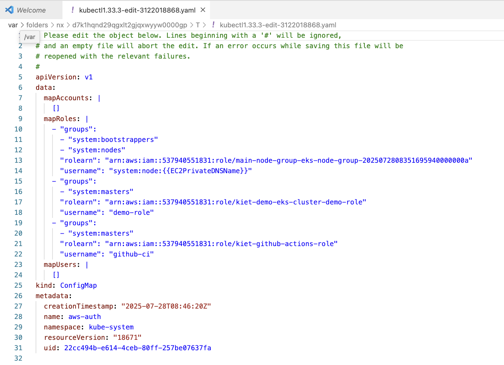

### Metric Server
- 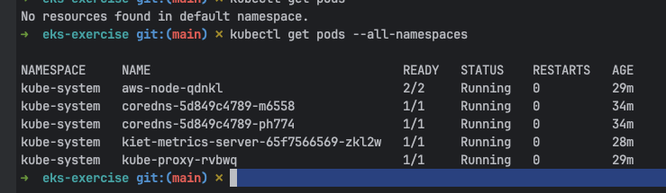

## Others
- Console information afte deployment
- 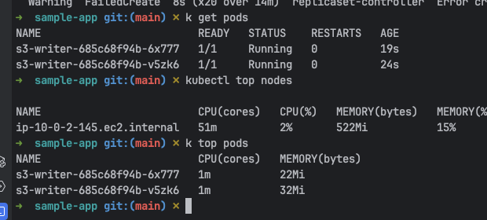

- EKS cluster overview
- 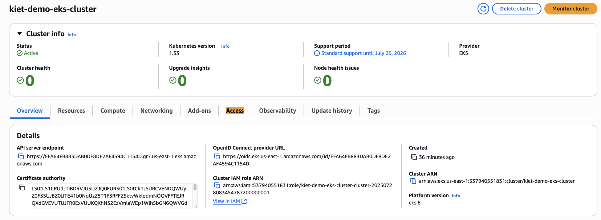

- EKS Pods after deploying
- 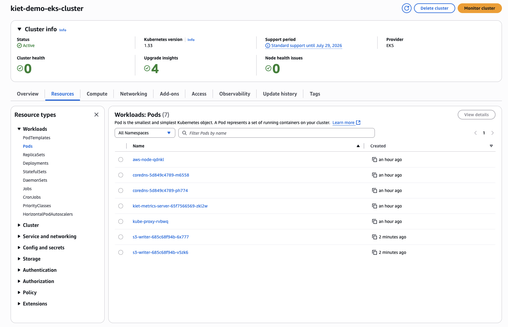

- Other screen show to show console UI after infrastructure deployed
- 
- 
- 
